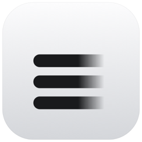

<div align="center">



# Nvisy Studio

**Detect and redact sensitive data across your documents.**

Nvisy's product console: a web app and a native desktop app, sharing one
dashboard through a Nuxt layer.

[](https://github.com/nvisycom/studio/actions/workflows/build.yml)
[](https://github.com/nvisycom/studio/actions/workflows/desktop.yml)
[](https://github.com/nvisycom/studio/actions/workflows/security.yml)
[](LICENSE.txt)

[**nvisy.com**](https://nvisy.com) · [**docs.nvisy.com**](https://docs.nvisy.com) · [**app.nvisy.com**](https://app.nvisy.com)

</div>

---

The dashboard (design system, feature views, and the data layer) lives in a
shared Nuxt layer, so both apps present the same experience. The web app is a
Nuxt SPA; the desktop app wraps the same frontend in a
[Tauri 2](https://tauri.app/) native shell and can point at any Nvisy server
(the hosted API by default, or a self-hosted one).

> [!WARNING]
> **Active development. API not stable.** Public APIs, configuration shapes, and
> on-disk formats may change without notice between releases.

## Workspace

An npm workspace split into deployable **apps** and the shared **packages** they
build on. The shared layer provides the whole dashboard; each app adds only its
own shell.

| Package | Path | Role |
| --- | --- | --- |
| **`@nvisy/console`** | [`packages/console`](packages/console/) | Nuxt layer with the whole dashboard surface: design system (shadcn-vue), feature views, composables, the `@nvisy/sdk` data layer, theme, and i18n |
| **`@nvisy/config`** | [`packages/config`](packages/config/) | Shared configuration and constants, a platform-neutral ESM library (tsdown) |
| **`@nvisy/webapp`** | [`apps/web`](apps/web/) | Web shell: a Nuxt 4 SPA served at [app.nvisy.com](https://app.nvisy.com) |
| **`@nvisy/desktop`** | [`apps/desktop`](apps/desktop/) | Desktop shell: the same frontend in a Tauri 2 (Rust) window; the Rust shell lives in `apps/desktop/tauri/` |

## Requirements

- **Node.js** 22.18+ and **npm** 10+
- **Rust + Cargo** (desktop app only)

## Quick start

```bash
make install                           # Install dependencies
npm run dev -w @nvisy/webapp           # Web dev server        (port 3000)
npm run dev -w @nvisy/desktop          # Desktop frontend dev  (port 1420)
npm run tauri -w @nvisy/desktop dev    # Desktop app in a Tauri window
npm run tauri:dev -w @nvisy/desktop    # …pointed at a local server (NVISY_DEV=1)
```

> [!NOTE]
> The desktop app defaults to the hosted server. `tauri:dev` sets `NVISY_DEV=1`
> to target a local one (`http://127.0.0.1:8080`) instead.

## Commands

| Command | What it does |
| --- | --- |
| `make build` | Build the web app → `./output` |
| `make build-desktop` | Build the desktop frontend |
| `make check` | Lint and format check (Biome) |
| `make clean` / `make repair` | Remove build artifacts / clean + reinstall |
| `npm run typecheck` | Type check all workspaces |
| `npm run icons -w @nvisy/desktop` | Regenerate desktop icons from `tauri/assets/` |

Desktop icons are generated from the SVG sources in `apps/desktop/tauri/assets/`.
See [`apps/desktop/tauri/icons/README.md`](apps/desktop/tauri/icons/README.md).

## Contributing

See [CONTRIBUTING.md](CONTRIBUTING.md) for development setup and guidelines.

## License

Apache 2.0 License, see [LICENSE.txt](LICENSE.txt).

## Support

- **Documentation**: [docs.nvisy.com](https://docs.nvisy.com)
- **Email**: [support@nvisy.com](mailto:support@nvisy.com)
